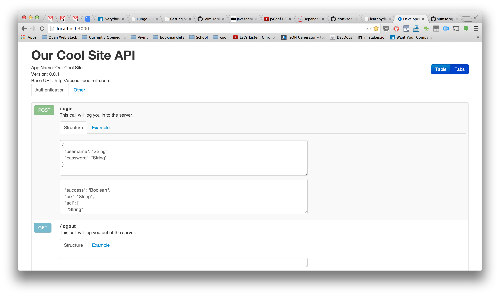

API Viewer
==========

Makes a nice looking API for you to show off to people :).


Here's how you format each API call:

```
{
  "group": "Authentication",
  "url": "/login",
  "description": "This call will log you in to the server.",
  "method": "POST",
  "example_data": {
    "username": "bubba",
    "password": "test"
  },
  "example_resp":{
    "success": false,
    "err": "bad username or password"
  },
  "resp":{
    "success":"Boolean",
    "err":"String"
  },
  "data":{
    "username":"String",
    "password":"String"
  }
}
```

Here's how it will look:



If you use `GET /file/api`, save an array of these objects at `config.file.path`. If you use `GET /couch/api` then make sure the database indicated at `config.couch` is full of documents that have the above format.
